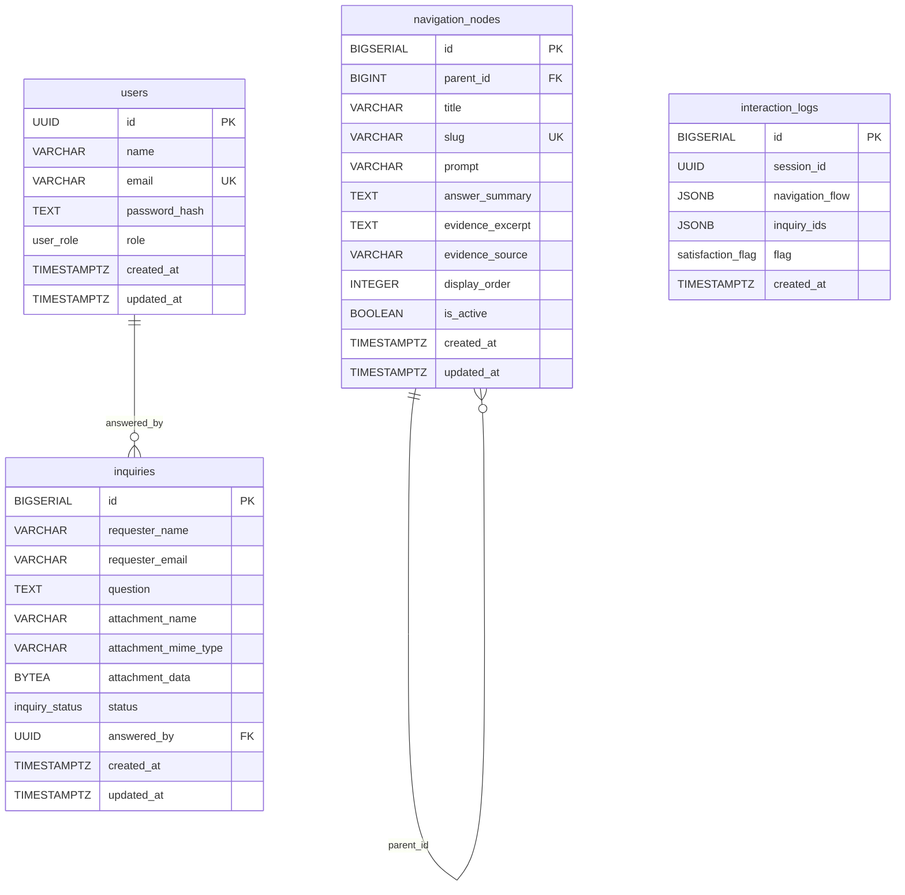

# Database

Scripts SQL de inicialização do PostgreSQL.

- `init/01_schema.sql`: estrutura principal (extensões, tipos e tabelas) + bloco de compatibilização de versões antigas
- `init/02_seed.sql`: carga inicial (usuários e árvore de navegação)

Detalhes de execução dos scripts em `init/`: `database/init/README.md`.

## Diagrama ER (Tabelas)

## Legenda

- `PK`: chave primária
- `FK`: chave estrangeira
- `UK`: chave única
- ENUMs: `user_role`, `inquiry_status`, `satisfaction_flag`

## Campos Relevantes

### `users`

- `name`: nome exibido do usuário interno (admin/secretaria).
- `email`: login único do usuário.
- `password_hash`: senha criptografada.
- `role`: perfil de acesso (`ADMIN` ou `SECRETARIA`).

### `navigation_nodes`

- `parent_id`: define a hierarquia da árvore de navegação (nó pai).
- `title`: texto da opção exibida para o usuário.
- `slug`: identificador único e estável do nó (útil para seed e integrações).
- `prompt`: texto de orientação/pergunta exibido no fluxo.
- `answer_summary`: resposta principal apresentada ao usuário.
- `evidence_excerpt`: trecho de evidência em texto livre.
- `evidence_source`: origem da evidência (ex.: nome/link do documento).
- `display_order`: ordem de exibição dos nós no mesmo nível.
- `is_active`: controla se o nó aparece na navegação.

### `inquiries`

- `requester_name`: nome completo de quem enviou a dúvida.
- `requester_email`: e-mail de quem enviou a dúvida.
- `question`: dúvida enviada pelo usuário.
- `attachment_name`: nome do arquivo de imagem anexado (opcional).
- `attachment_mime_type`: tipo MIME da imagem anexada (opcional, ex.: `image/png`).
- `attachment_data`: conteúdo binário da imagem anexada (opcional).
- `status`: situação da dúvida (`ABERTA` ou `RESPONDIDA`).
- `answered_by`: usuário interno (`SECRETARIA`/`ADMIN`) que respondeu; não há login de aluno.

### `interaction_logs`

- `session_id`: identificador da sessão de atendimento.
- `navigation_flow`: sequência de opções navegadas pelo usuário, acumulada no mesmo registro da sessão.
- `inquiry_ids`: lista de todas as dúvidas (`id`) registradas na sessão.
- `flag`: avaliação de satisfação opcional (`ATENDEU`/`NAO_ATENDEU`).

## Observações

- Senhas são armazenadas com `crypt(..., gen_salt('bf'))`.
- O fluxo de dúvidas aceita até 1 imagem por solicitação.
- Os scripts de `init/` são executados automaticamente no primeiro bootstrap do banco.
- Para reaplicar os scripts de init, remova o volume `postgres_data`.
