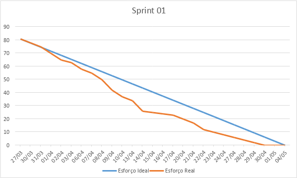

# Sprint 01

## Status

## Período

| Marco | Data |
| --- | --- |
| Entrega prevista | 05/05/2026 |

## Objetivo

Entregar um MVP apresentavel do fluxo publico do FAQtec, validando a navegacao inicial do chatbot e as primeiras telas do frontend com dados mockados, sem compromisso de integrar a aplicacao ao backend ou ao banco nesta etapa.

## Sprint Backlog

| ID | Frente | Item | Prioridade | Recorte da Sprint |
| --- | --- | --- | --- | --- |
| DW01 | Frontend | Escolha inicial de curso ou perfil |  | Implementar a tela inicial com as opções `DSM`, `Geoprocessamento`, `MARH` e `Não sou aluno`. |
| DW02 | Frontend | Navegação por menus e submenus |  | Implementar a navegação local com base no mockup e dados mockados, cobrindo pelo menos dois fluxos de demonstração. |
| DW04 | Frontend | Respostas resumidas e padronizadas |  | Exibir uma resposta final padronizada ao fim dos fluxos implementados nesta sprint. |
| DW07 | Frontend | Frontend em React com TypeScript |  | Estruturar a base do frontend e entregar as primeiras telas navegáveis do chatbot. |
| ES01 | Documentação | Documentação e diagramas UML |  | Produzir a documentação inicial do repositório e o diagrama de casos de uso. |

## Resultado do Ciclo

- A sprint entregou um prototipo funcional do frontend com fluxo local para demonstracao.
- O objetivo de navegacao foi cumprido apenas em modo mockado, sem integracao real com API ou banco.
- A documentacao da sprint foi iniciada, mas permaneceu com lacunas de execucao, estrutura e coerencia entre repositório e implementacao.

## Entregas

- Tela inicial do chatbot com escolha de curso ou perfil.
- Navegação por menus e submenus com dados locais.
- Respostas finais padronizadas para os fluxos demonstrados.
- Primeiras telas do frontend com responsividade básica.
- Diagrama inicial de casos de uso.

## Evidências

- Figma: <https://www.figma.com/design/nxX4kUKGSKeNLARNj0iMDf/ChatBoot--Fatec?node-id=0-1&t=9pcagDnITzTyB96i-0>
- Diagrama UML de Casos de Uso: <https://github.com/404NotFound-ABP/Autoatendimento_Academico/blob/docs/DOCS/diagrama/UseCase%20Diagram.png>

## Retrospectiva Documentada

### O que ficou valido na sprint

- A equipe conseguiu validar o fluxo inicial do chatbot para demonstração.
- O conteúdo base do desafio foi organizado em textos e menus que podem servir de insumo para seed e integração futura.
- A documentação de produto e de sprint ganhou uma primeira estrutura rastreável.

### O que nao atendeu integralmente ao DoD do produto

- `DW02`: a navegação foi entregue com dados mockados, sem leitura a partir do banco de dados.
- `DW04`: as respostas foram demonstradas no frontend, mas sem integração com a base oficial do produto.
- `ES01`: o README principal, os READMEs por pasta e a coerência estrutural do repositório não ficaram completos.

### Carry-over para a Sprint 2

| Item | Motivo do carry-over | Encaminhamento |
| --- | --- | --- |
| DW02 | Fluxo ainda local, sem API nem banco | Integrar a navegação real com backend e PostgreSQL |
| DW04 | Respostas ainda dependentes do mock do frontend | Vincular respostas ao fluxo persistido e às evidências do domínio |
| ES01 | Documentação e estrutura do repositório ainda incoerentes | Corrigir README, READMEs por pasta, diagramas e alinhamento doc x implementação |

## Tasks

| ID | Descrição | Autor(es) | Data | Pontuação | Status |
| --- | --- | --- | --- | --- | --- |
| DW01.1 | Definir identidade visual do site | Ariana, Eloah, Felipe, Lucas, Luiza, Pedro, William | 30/03 | 3 | ✅ |
| DW01.2 | Criar protótipo da página da tela inicial | Pedro | 31/03 | 3 | ✅ |
| DW01.3 | Criar protótipo do chatbot | Pedro | 01/04 | 5 | ✅ |
| DW01.4 | Criar protótipo da página administrativa | Pedro | 02/04 | 5 | ✅ |
| DW01.5 | Criar protótipo da página de login | Pedro | 03/04 | 2 | ✅ |
| DW02.1 | Criar base do projeto frontend em React + TypeScript | Eloah | 06/04 | 5 | ✅ |
| DW02.2 | Implementar componente de mensagem/pergunta do chatbot | Eloah | 07/04 | 3 | ✅ |
| DW02.3 | Implementar componente de opções de resposta | Eloah | 08/04 | 5 | ✅ |
| DW02.4 | Implementar avanço de etapa conforme a opção escolhida | Eloah | 09/04 | 8 | ✅ |
| DW02.5 | Implementar ação de voltar para a etapa anterior | Eloah | 10/04 | 5 | ✅ |
| DW02.6 | Implementar retorno ao menu inicial | Eloah | 13/04 | 3 | ✅ |
| DW02.7 | Garantir responsividade básica para mobile e desktop | Eloah | 14/04 | 8 | ✅ |
| DW04.1 | Escrever os textos finais padronizados do fluxo DSM | Ariana | 15/04 | 1 | ✅ |
| DW04.2 | Escrever os textos finais padronizados do fluxo Não sou aluno | Ariana | 16/04 | 1 | ✅ |
| DW04.3 | Definir o padrão de resposta final do chatbot | Ariana | 17/04 | 1 | ✅ |
| DW07 | Definir estrutura inicial de pastas, componentes e dados mockados | Lucas, William | 20/04 | 3 | ✅ |
| ES01.1 | Desenvolver o diagrama de casos de uso | Ariana, Luiza | 21/04 | 3 | ✅ |
| ES01.2 | Desenvolver Product Backlog | Felipe, Luiza | 22/04 | 5 | ✅ |
| ES01.3 | Desenvolver Backlog da Sprint 1 | Felipe, Luiza | 23/04 | 2 | ✅ |
| ES01.4 | Desenvolver Backlog da Sprint 2 | Felipe, Luiza | 24/04 | 2 | ✅ |
| ES01.5 | Desenvolver Backlog da Sprint 3 | Felipe, Luiza | 27/04 | 2 | ✅ |
| ES01.6 | Desenvolver tasks da Sprint 1 | Felipe, Luiza | 28/04 | 2 | ✅ |
| ES01.7 | Desenvolver tasks da Sprint 2 | Felipe, Luiza | 29/04 | 2 | ✅ |
| ES01.8 | Desenvolver tasks da Sprint 3 | Felipe, Luiza | 30/04 | 2 | ✅ |

## Burndown

## Observações

- O escopo comprometido da Sprint 1 era de MVP demonstrável, e não de integração completa.
- A partir da revisão do professor, a equipe passou a tratar `DW02`, `DW04` e `ES01` como itens reabertos na Sprint 2 para atender o DoD do produto.
- A Sprint 2 concentra a conversão do protótipo em fluxo público real, com integração, persistência e documentação coerente.
